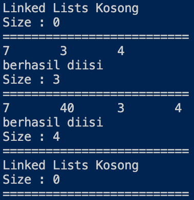
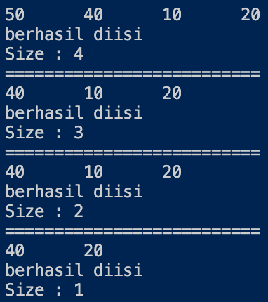
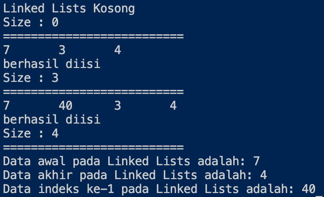
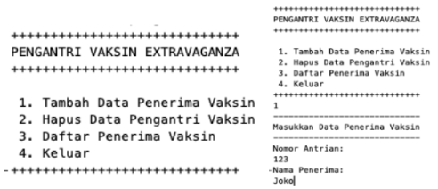
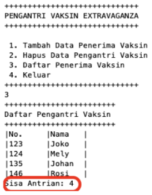
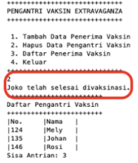
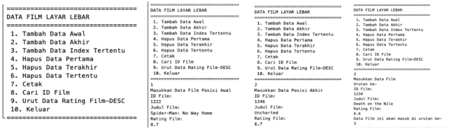
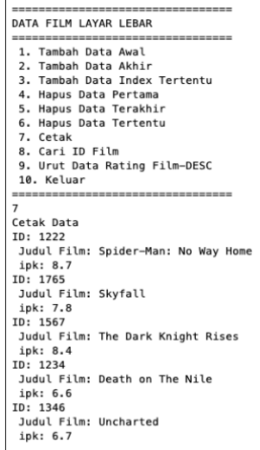
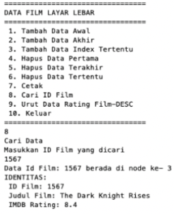

Nama    : Alfi Surya Pratama

Kelas   : TI-1F

NIM     : 2141720075

# **PRAKTIKUM ALGORITMA DAN STRUKTUR DATA**
## **JOBSHEET 10**
## **DOUBLE LINKED LISTS**

### **10.2 Kegiatan Praktikum 1**

### *10.2.1 Langkah-langkah Percobaan*

*Class "Node"*

~~~java
public class Node {
    int data;
    Node prev, next;

    Node(Node prev, int data, Node next) {
        this.prev = prev;
        this.data = data;
        this.next = next;
    }
}
~~~

*Class "DoubleLinkedLists"*

~~~java
public class DoubleLinkedLists {
    Node head;
    int size;
    
    public DoubleLinkedLists() {
        head = null;
        size = 0;
    }

    public boolean isEmpty() {
        return head == null;
    }

    public void addFirst(int item) {
        if (isEmpty()) {
            head = new Node(null, item, null);
        } else {
            Node newNode = new Node(null, item, head);
            head.prev = newNode;
            head = newNode;
        }
        size++;
    }

    public void addLast(int item) {
        if (isEmpty()) {
            addFirst(item);
        } else {
            Node current = head;
            while (current.next != null) {
                current = current.next;
            }
            Node newNode = new Node(current, item,null);
            current.next = newNode;
            size++;
        }
    }

    public void add(int item, int index) throws Exception {
        if (isEmpty()) {
            addFirst(item);
        } else if (index < 0 || index > size) {
            throw new Exception("Nilai indeks di luar batas");
        } else {
            Node current = head;
            int i = 0;
            while (i < index) {
                current = current.next;
                i++;
            }
            if (current.prev == null) {
                Node newNode = new Node(null, item, current);
                current.prev = newNode;
                head = newNode;
            } else {
                Node newNode = new Node(current.prev, item, current);
                newNode.prev = current.prev;
                newNode.next = current;
                current.prev.next = newNode;
                current.prev = newNode;
            }
        }
        size++;
    }

    public int size() {
        return size;
    }

    public void clear() {
        head = null;
        size = 0;
    }

    public void print() {
        if (!isEmpty()) {
            Node tmp = head;
            while (tmp != null) {
                System.out.print(tmp.data + "\t");
                tmp = tmp.next;
            }
            System.out.println("\nberhasil diisi");
        } else {
            System.out.println("Linked Lists Kosong");
        }
    }
}
~~~

*Main Class "DoubleLinkedListsMain"*

~~~java
public class DoubleLinkedListsMain {
    public static void main(String[] args) throws Exception {
        DoubleLinkedLists dll = new DoubleLinkedLists();
        dll.print();
        System.out.println("Size : + " + dll.size());
        System.out.println("==========================");
        dll.addFirst(3);
        dll.addLast(4);
        dll.addFirst(7);
        dll.print();
        System.out.println("Size : + " + dll.size());
        System.out.println("==========================");
        dll.add(40, 1);
        dll.print();
        System.out.println("Size : + " + dll.size());
        System.out.println("==========================");
        dll.clear();
        dll.print();
        System.out.println("Size : " + dll.size());
        System.out.println("==========================");
    }    
}
~~~

### *10.2.2 Verfikasi Hasil Percobaan*

### *10.2.3 Pertanyaan Percobaan*

1. Jelaskan perbedaan antara single linked list dengan double linked lists!

    - *Single Linked List : memiliki satu buah pointer yaitu next.*

    - *Double Linked Lists : memiliki dua buah pointer yaitu pointer next dan prev.*

2. Perhatikan class Node, didalamnya terdapat atribut next dan prev. Untuk apakah atribut tersebut?

    *Pointer next menunjuk pada node setelahnya, dan pointer prev menunjuk pada node sebelumnya.*

3. Perhatikan konstruktor pada class DoubleLinkedLists. Apa kegunaan inisialisasi atribut head dan size seperti pada gambar berikut ini?

    ~~~java
    public DoubleLinkedLists() {
        head = null;
        size = 0;
    }
    ~~~

    *Potongan kode di atas berfungsi sebagai kondisi awal dari pogram tersebut, fungsu inisialisasi "head = null" untuk head belum menyimpan pada node, sedangkan fungsi inisialisasi "size = 0" untuk menyimpan jumlah data pada linked list.*

4. Pada method addFirst(), kenapa dalam pembuatan object dari konstruktor class Node prev dianggap sama dengan null?

    ~~~java
    Node newNode = new Node(null, item, head);
    ~~~

    *karena pada method addFirst() di atas digunakan untuk menambah node pada awal atau index ke-0, dimana nantinya node yang dimasukkan tersebut prev nya bernilai null karena tidak merujuk atau menyimpan nilai dari node manapun.*

5. Perhatikan pada method addFirst(). Apakah arti statement head.prev = newNode ?

    *Potongan kode di atas berfungsi untuk pointer prev pada data yang sudah ada sebelumnya akan menyimpan atau merujuk ke node yang baru.*

6. Perhatikan isi method addLast(), apa arti dari pembuatan object Node dengan mengisikan parameter prev dengan current, dan next dengan null?

    ~~~java
    Node newNode = new Node(current, item, null);
    ~~~

    *Karena pada methode addLast() di atas digunakan untuk menambahkan node pada akhir atau index terakhir, dimana parameter prev dengan current digunakan untuk menyimpan node sebelumnya, dimana nantinya terjadi proses penambahan data pada index terakhir, sedangkan pada parameter next dengan null karena tidak merujuk pada node manapun karena sudah berada di akhir.*

### **10.3 Kegiatan Praktikum 1**

### *10.3.1 Langkah-langkah Percobaan*

*Class "Node"*

~~~java
public class Node {
    int data;
    Node prev, next;

    Node(Node prev, int data, Node next) {
        this.prev = prev;
        this.data = data;
        this.next = next;
    }
}
~~~

*Class "DoubleLinkedLists"*

~~~java
public class DoubleLinkedLists {
    Node head;
    int size;
    
    public DoubleLinkedLists() {
        head = null;
        size = 0;
    }

    public boolean isEmpty() {
        return head == null;
    }

    public void addFirst(int item) {
        if (isEmpty()) {
            head = new Node(null, item, null);
        } else {
            Node newNode = new Node(null, item, head);
            head.prev = newNode;
            head = newNode;
        }
        size++;
    }

    public void addLast(int item) {
        if (isEmpty()) {
            addFirst(item);
        } else {
            Node current = head;
            while (current.next != null) {
                current = current.next;
            }
            Node newNode = new Node(current, item,null);
            current.next = newNode;
            size++;
        }
    }

    public void add(int item, int index) throws Exception {
        if (isEmpty()) {
            addFirst(item);
        } else if (index < 0 || index > size) {
            throw new Exception("Nilai indeks di luar batas");
        } else {
            Node current = head;
            int i = 0;
            while (i < index) {
                current = current.next;
                i++;
            }
            if (current.prev == null) {
                Node newNode = new Node(null, item, current);
                current.prev = newNode;
                head = newNode;
            } else {
                Node newNode = new Node(current.prev, item, current);
                newNode.prev = current.prev;
                newNode.next = current;
                current.prev.next = newNode;
                current.prev = newNode;
            }
        }
        size++;
    }

    public int size() {
        return size;
    }

    public void clear() {
        head = null;
        size = 0;
    }

    public void print() {
        if (!isEmpty()) {
            Node tmp = head;
            while (tmp != null) {
                System.out.print(tmp.data + "\t");
                tmp = tmp.next;
            }
            System.out.println("\nberhasil diisi");
        } else {
            System.out.println("Linked Lists Kosong");
        }
    }

    public void removeFirst() throws Exception {
        if (isEmpty()) {
            throw new Exception("Linked List masih kosong, tidak dapat dihapus!");
        } else if (size == 1) {
            removeLast();
        } else {
            head = head.next;
            head.prev = null;
            size--;
        }
    }

    public void removeLast() throws Exception {
        if (isEmpty()) {
            throw new Exception("Linked List masih kosong, tidak dapat dihapus!");
        } else if (head.next == null) {
            head = null;
            size--;
            return;
        }
        Node current = head;
        while (current.next != null) {
            current = current.next;
        }
        current.next = null;
        size--;
    }

    public void remove(int index) throws Exception {
        if (isEmpty() || index >= size) {
            throw new Exception("Nilai indeks di luar batas");
        } else if (index == 0) {
            removeFirst();
        } else {
            Node current = head;
            int i = 0;
            while (i < index) {
                current = current.next;
                i++;
            }
            if (current.next == null) {
                current.prev.next = null;
            } else if (current.prev == null) {
                current = current.next;
                current.prev = null;
                head = current;
            } else {
                current.prev.next = current.next;
                current.next.prev = current.prev;
            }
            size--;
        }
    }
}
~~~
*Main Class "DoubleLinkedListsMain"*

~~~java
public class DoubleLinkedListsMain {
    public static void main(String[] args) throws Exception {
        DoubleLinkedLists dll = new DoubleLinkedLists();
        dll.print();
        System.out.println("Size : " + dll.size());
        System.out.println("==========================");
        dll.addFirst(3);
        dll.addLast(4);
        dll.addFirst(7);
        dll.print();
        System.out.println("Size : " + dll.size());
        System.out.println("==========================");
        dll.add(40, 1);
        dll.print();
        System.out.println("Size : " + dll.size());
        System.out.println("==========================");
        dll.clear();
        dll.print();
        System.out.println("Size : " + dll.size());
        System.out.println("==========================");
        
        dll.addLast(50);
        dll.addLast(40);
        dll.addLast(10);
        dll.addLast(20);
        dll.print();
        System.out.println("Size : " + dll.size());
        System.out.println("==========================");
        dll.removeFirst();
        dll.print();
        System.out.println("Size : " + dll.size());
        System.out.println("==========================");
        dll.removeLast();
        dll.print();
        System.out.println("Size : " + dll.size());
        System.out.println("==========================");
        dll.remove(1);
        dll.print();
        System.out.println("Size : " + dll.size());
    }    
}
~~~

### *10.3.2 Verfikasi Hasil Percobaan*

### *10.3.3 Pertanyaan Percobaan*

1. Apakah maksud statement berikut pada method removeFirst()?
    
    ~~~java
    head = head.next;
    head.prev = null;
    ~~~

    *Maksud dari potongan kode di atas adalah penghapusan pada index awal maka posisi head akan berpindah ke posisi node selanjutnya, dan pointer prev pada head akan bernilai null karena tidak menyimpan atau merujuk pada node manapun.*

2. Bagaimana cara mendeteksi posisi data ada pada bagian akhir pada method removeLast()?

    *Dengan cara mencari posisi node yang pointer nextnya bernilai null. Jika sudah ditemukan maka bisa dipastikan node tersebut berada pada index terakhir.*

3. Jelaskan alasan potongan kode program di bawah ini tidak cocok untuk perintah remove!

    ~~~java
    Node tmp = head.next;

    head.next = tmp.next;
    tmp.next.prev = head;
    ~~~

    *Potongan kode di atas tidak cocok untuk perintah remove, karena potongan kode tersebut cocok digunakan untuk removeFirst dimana tmp menyimpan data setelah head. Selanjutnya head.next menyimpan data tmp.next. Kemdidan pointer prev pada tmp.next menunjuk ke head. Maka dari itu dapat disimpulan penerapan potongan kode di atas tidak cocok untuk perintah remove.*

4. Jelaskan fungsi kode program berikut ini pada fungsi remove!

    ~~~java
    current.prev.next = current.next;
    urrent.next.prev = current.prev;
    ~~~

    *Fungsi potongan kode di atas adalah untuk merubah nilai yang tadinya ada pada current.prev.next atau pointer pada node sebelumnya akan dipindahkan pada current.next. Sedangkan pada current.next.prev atau pointer prev pada node selanjutnya akan dipindahkan pada current.prev.*

### **10.4 Kegiatan Praktikum 3**

### *10.4.1 Langkah-langkah Percobaan*

*Class "Node"*

~~~java
public class Node {
    int data;
    Node prev, next;

    Node(Node prev, int data, Node next) {
        this.prev = prev;
        this.data = data;
        this.next = next;
    }
}
~~~

*Class "DoubleLinkedLists"*

~~~java
public class DoubleLinkedLists {
    Node head;
    int size;
    
    public DoubleLinkedLists() {
        head = null;
        size = 0;
    }

    public boolean isEmpty() {
        return head == null;
    }

    public void addFirst(int item) {
        if (isEmpty()) {
            head = new Node(null, item, null);
        } else {
            Node newNode = new Node(null, item, head);
            head.prev = newNode;
            head = newNode;
        }
        size++;
    }

    public void addLast(int item) {
        if (isEmpty()) {
            addFirst(item);
        } else {
            Node current = head;
            while (current.next != null) {
                current = current.next;
            }
            Node newNode = new Node(current, item,null);
            current.next = newNode;
            size++;
        }
    }

    public void add(int item, int index) throws Exception {
        if (isEmpty()) {
            addFirst(item);
        } else if (index < 0 || index > size) {
            throw new Exception("Nilai indeks di luar batas");
        } else {
            Node current = head;
            int i = 0;
            while (i < index) {
                current = current.next;
                i++;
            }
            if (current.prev == null) {
                Node newNode = new Node(null, item, current);
                current.prev = newNode;
                head = newNode;
            } else {
                Node newNode = new Node(current.prev, item, current);
                newNode.prev = current.prev;
                newNode.next = current;
                current.prev.next = newNode;
                current.prev = newNode;
            }
        }
        size++;
    }

    public int size() {
        return size;
    }

    public void clear() {
        head = null;
        size = 0;
    }

    public void print() {
        if (!isEmpty()) {
            Node tmp = head;
            while (tmp != null) {
                System.out.print(tmp.data + "\t");
                tmp = tmp.next;
            }
            System.out.println("\nberhasil diisi");
        } else {
            System.out.println("Linked Lists Kosong");
        }
    }

    public void removeFirst() throws Exception {
        if (isEmpty()) {
            throw new Exception("Linked List masih kosong, tidak dapat dihapus!");
        } else if (size == 1) {
            removeLast();
        } else {
            head = head.next;
            head.prev = null;
            size--;
        }
    }

    public void removeLast() throws Exception {
        if (isEmpty()) {
            throw new Exception("Linked List masih kosong, tidak dapat dihapus!");
        } else if (head.next == null) {
            head = null;
            size--;
            return;
        }
        Node current = head;
        while (current.next != null) {
            current = current.next;
        }
        current.next = null;
        size--;
    }

    public void remove(int index) throws Exception {
        if (isEmpty() || index >= size) {
            throw new Exception("Nilai indeks di luar batas");
        } else if (index == 0) {
            removeFirst();
        } else {
            Node current = head;
            int i = 0;
            while (i < index) {
                current = current.next;
                i++;
            }
            if (current.next == null) {
                current.prev.next = null;
            } else if (current.prev == null) {
                current = current.next;
                current.prev = null;
                head = current;
            } else {
                current.prev.next = current.next;
                current.next.prev = current.prev;
            }
            size--;
        }
    }

    public int getFirst() throws Exception {
        if (isEmpty()) {
            throw new Exception("Linked List kosong");
        }
        return head.data;
    }

    public int getLast() throws Exception {
        if (isEmpty()) {
            throw new Exception("Linked List kosong");
        }
        Node tmp = head;
        while (tmp.next != null) {
            tmp = tmp.next;
        }
        return tmp.data;
    }

    public int get(int index) throws Exception {
        if (isEmpty() || index >= size) {
            throw new Exception("Nilai indeks di luar batas.");
        }
        Node tmp = head;
        for (int i = 0; i < index; i++) {
            tmp = tmp.next;
        }
        return tmp.data;
    }
}
~~~

*Main Class "DoubleLinkedListsMain"*

~~~java
public class DoubleLinkedListsMain {
    public static void main(String[] args) throws Exception {
        DoubleLinkedLists dll = new DoubleLinkedLists();
        dll.print();
        System.out.println("Size : " + dll.size());
        System.out.println("==========================");
        dll.addFirst(3);
        dll.addLast(4);
        dll.addFirst(7);
        dll.print();
        System.out.println("Size : " + dll.size());
        System.out.println("==========================");
        dll.add(40, 1);
        dll.print();
        System.out.println("Size : " + dll.size());
        System.out.println("==========================");
        dll.clear();
        dll.print();
        System.out.println("Size : " + dll.size());
        System.out.println("==========================");
        
        dll.addLast(50);
        dll.addLast(40);
        dll.addLast(10);
        dll.addLast(20);
        dll.print();
        System.out.println("Size : " + dll.size());
        System.out.println("==========================");
        dll.removeFirst();
        dll.print();
        System.out.println("Size : " + dll.size());
        System.out.println("==========================");
        dll.removeLast();
        dll.print();
        System.out.println("Size : " + dll.size());
        System.out.println("==========================");
        dll.remove(1);
        dll.print();
        System.out.println("Size : " + dll.size());
    
        dll.print();
        System.out.println("Size : " + dll.size());
        System.out.println("==========================");
        dll.addFirst(3);
        dll.addLast(4);
        dll.addFirst(7);
        dll.print();
        System.out.println("Size : " + dll.size());
        System.out.println("==========================");
        dll.add(40, 1);
        dll.print();
        System.out.println("Size : " + dll.size());
        System.out.println("==========================");
        System.out.println("Data awal pada Linked Lists adalah: " + dll.getFirst());
        System.out.println("Data akhir pada Linked Lists adalah: " + dll.getLast());
        System.out.println("Data indeks ke-1 pada Linked Lists adalah: " + dll.get(1));
    }    
}
~~~

### *10.4.2 Verfikasi Hasil Percobaan*

### *10.4.3 Pertanyaan Percobaan*

1. Jelaskan method size() pada class DoubleLinkedLists!

    *Method size() di atas berfungsi mereturn nilai menjadi 0 jika dalam kondisi tidak ada (kosong).*

2. Jelaskan cara mengatur indeks pada double linked lists supaya dapat dimulai dari indeks ke-1!

    *Dengan cara melakukan perulangan yang dimana diinisialisasikan dengan index sama dengan 1.*

3. Jelaskan perbedaan karakteristik fungsi Add pada Double Linked Lists dan Single Linked Lists!

    - *Fungsi add pada double linked lists hanya memiliki satu fungsi yang berdasarkan index sisanya dapat ditambah dari awal atau akhir index.*

    - *Fungsi add pada single linked list memiliki tiga fungsi yaitu insertAfter, insertBefore, dan insertAt.*

4. Jelaskan perbedaan logika dari kedua kode program di bawah ini!

    (a)
    ~~~java
    public boolean isEmpty() {
        if (size == 0) {
            return true;
        } else {
            return false;
        }
    }
    ~~~

    (b) 
    ~~~java
    public boolean isEmpty() {
        return head == null;
    }
    ~~~

    *Pada gambar (a) terdapat if else yang dimana jika size = 0 maka true sedangkan jika tidak maka false. Sedangkan pada gambar (b) tidak menggunakan if else tetapi hanya langsung menentukan apakah head bernilai null jika benar maka kondisinya adalah true.*

### **10.5 Tugas Praktikum**

1. Buat program antrian vaksinasi menggunakan queue berbasis double linked list sesuai ilustrasi dan menu di bawah ini! **(counter jumlah antrian tersisa di menu cetak(3) dan data orang yang telah divaksinasi di menu Hapus Data(2) harus ada)**

    **Ilustrasi Program**

    *Menu Awal dan Penambahan Data*

    

    *Cetak Data **(Komponen di area merah harus ada)***

    

    *Hapus Data **(Komponen di area merah harus ada)***

    

2. Buatlah program daftar film yang terdiri dari id, judul dan rating menggunakan double linked lists, bentuk program memiliki fitur pencarian melalui ID Film dan pengurutan Rating secara descending. Class Film wajib diimplementasikan dalam soal ini.

    **Contoh Ilustrasi Program**

    *MenuAwal dan Penambahan Data*

    

    *Cetak Data*

    

    *Pencarian data*

    