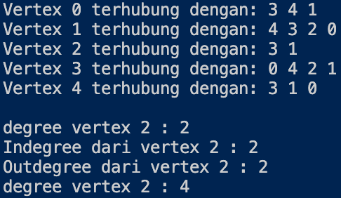
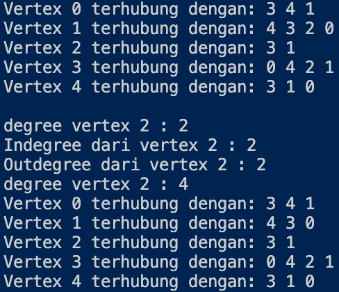
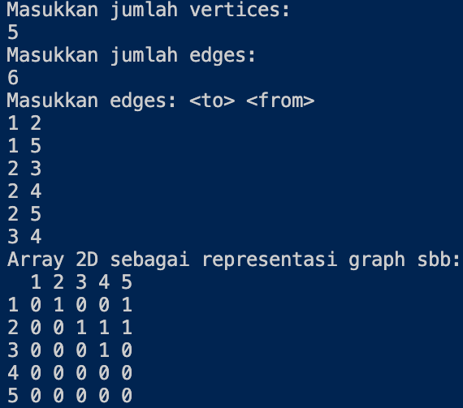

Nama    : Alfi Surya Pratama

Kelas   : TI-1F

NIM     : 2141720075

# **PRAKTIKUM ALGORITMA DAN STRUKTUR DATA**
## **JOBSHEET 12**
## **GRAPH**

### **12.2  Implementasi Graph menggunakan Linked List**

### *12.2.1 Tahapan Percobaan*

*Class "Node"*

~~~java
public class Node {
    int data;
    Node prev, next;

    Node(Node prev, int data, Node next) {
        this.prev = prev;
        this.data = data;
        this.next = next;
    }
}
~~~

*Class "LinkedList"*

~~~java
public class LinkedList {
    Node head;
    int size;
    
    public LinkedList() {
        head = null;
        size = 0;
    }

    public boolean isEmpty() {
        return head == null;
    }

    public void addFirst(int item) {
        if (isEmpty()) {
            head = new Node(null, item, null);
        } else {
            Node newNode = new Node(null, item, head);
            head.prev = newNode;
            head = newNode;
        }
        size++;
    }

    public void addLast(int item) {
        if (isEmpty()) {
            addFirst(item);
        } else {
            Node current = head;
            while (current.next != null) {
                current = current.next;
            }
            Node newNode = new Node(current, item,null);
            current.next = newNode;
            size++;
        }
    }

    public void add(int item, int index) throws Exception {
        if (isEmpty()) {
            addFirst(item);
        } else if (index < 0 || index > size) {
            throw new Exception("Nilai indeks di luar batas");
        } else {
            Node current = head;
            int i = 0;
            while (i < index) {
                current = current.next;
                i++;
            }
            if (current.prev == null) {
                Node newNode = new Node(null, item, current);
                current.prev = newNode;
                head = newNode;
            } else {
                Node newNode = new Node(current.prev, item, current);
                newNode.prev = current.prev;
                newNode.next = current;
                current.prev.next = newNode;
                current.prev = newNode;
            }
        }
        size++;
    }

    public int size() {
        return size;
    }

    public void clear() {
        head = null;
        size = 0;
    }

    public void print() {
        if (!isEmpty()) {
            Node tmp = head;
            while (tmp != null) {
                System.out.print(tmp.data + "\t");
                tmp = tmp.next;
            }
            System.out.println("\nberhasil diisi");
        } else {
            System.out.println("Linked Lists Kosong");
        }
    }

    public void removeFirst() throws Exception {
        if (isEmpty()) {
            throw new Exception("Linked List masih kosong, tidak dapat dihapus!");
        } else if (size == 1) {
            removeLast();
        } else {
            head = head.next;
            head.prev = null;
            size--;
        }
    }

    public void removeLast() throws Exception {
        if (isEmpty()) {
            throw new Exception("Linked List masih kosong, tidak dapat dihapus!");
        } else if (head.next == null) {
            head = null;
            size--;
            return;
        }
        Node current = head;
        while (current.next != null) {
            current = current.next;
        }
        current.next = null;
        size--;
    }

    public void remove(int index) throws Exception {
        if (isEmpty() || index >= size) {
            throw new Exception("Nilai indeks di luar batas");
        } else if (index == 0) {
            removeFirst();
        } else {
            Node current = head;
            int i = 0;
            while (i < index) {
                current = current.next;
                i++;
            }
            if (current.next == null) {
                current.prev.next = null;
            } else if (current.prev == null) {
                current = current.next;
                current.prev = null;
                head = current;
            } else {
                current.prev.next = current.next;
                current.next.prev = current.prev;
            }
            size--;
        }
    }

    public int getFirst() throws Exception {
        if (isEmpty()) {
            throw new Exception("Linked List kosong");
        }
        return head.data;
    }

    public int getLast() throws Exception {
        if (isEmpty()) {
            throw new Exception("Linked List kosong");
        }
        Node tmp = head;
        while (tmp.next != null) {
            tmp = tmp.next;
        }
        return tmp.data;
    }

    public int get(int index) throws Exception {
        if (isEmpty() || index >= size) {
            throw new Exception("Nilai indeks di luar batas.");
        }
        Node tmp = head;
        for (int i = 0; i < index; i++) {
            tmp = tmp.next;
        }
        return tmp.data;
    }
}
~~~

*Class "Graph"*

~~~java
public class Graph {
    int vertex;
    LinkedList list[];

    public Graph(int vertex) {
        this.vertex = vertex;
        list = new LinkedList[vertex];
        for (int i = 0; i < vertex; i++) {
            list[i] = new LinkedList();
        }
    }

    public void addEdge(int source, int destination) {
        //add edge
        list[source].addFirst(destination);

        //add back edge (for undirected)
        list[destination].addFirst(source);
    }

    public void degree(int source) throws Exception {
        //degree undirected graph
        System.out.println("degree vertex " + source + " : " + list[source].size());

        //degree directed graph
            //inDegree
        int k, totalIn = 0, totalOut = 0;
        for (int i = 0; i < vertex; i++) {
            for (int j = 0; j < list[i].size(); j++) {
                if (list[i].get(j) == source)
                    ++totalIn;
            }
            
            //outDegree
            for (k = 0; k < list[source].size(); k++) {
                list[source].get(k);
            }
            totalOut = k;
        }
        System.out.println("Indegree dari vertex " + source + " : " + totalIn);
        System.out.println("Outdegree dari vertex " + source + " : " + totalOut);
        System.out.println("degree vertex " + source + " : " + (totalIn + totalOut));
    }

    public void removeEdge(int source, int destination) throws Exception {
        for (int i = 0; i < vertex; i++) {
            if (i == destination) {
                list[source].remove(destination);
            }
        }
    }

    public void removeAllEdges() {
        for (int i = 0; i < vertex; i++) {
            list[i].clear();
        }
        System.out.println("Graph berhasil dihapus");
    }

    public void printGraph() throws Exception {
        for (int i = 0; i < vertex; i++) {
            if (list[i].size() > 0) {
                System.out.print("Vertex " + i + " terhubung dengan: ");
                for (int j = 0; j < list[i].size(); j++) {
                    System.out.print(list[i].get(j) + " ");
                }
                System.out.println("");
            }
        }
        System.out.println(" ");
    }
}
~~~

*Main Class "GraphMain"*

~~~java
public class GraphMain {
    public static void main(String[] args) throws Exception {
        Graph graph = new Graph(6);
        graph.addEdge(0, 1);
        graph.addEdge(0, 4);
        graph.addEdge(1, 2);
        graph.addEdge(1, 3);
        graph.addEdge(1, 4);
        graph.addEdge(2, 3);
        graph.addEdge(3, 4);
        graph.addEdge(3, 0);
        graph.printGraph();
        graph.degree(2);

        graph.removeEdge(1, 2);
        graph.printGraph();
    }
}
~~~

### *12.2.2 Verifikasi Hasil Percobaan*

*Hasil running pada langkah ke-11*

*Hasil running pada langkah ke-11*

### *12.2.3 Pernyataan Percobaan*

1. Sebutkan beberapa jenis (minimal 3) algoritma yang menggunakan dasar Graph, dan apakah kegunaan algoritma-algoritma tersebut?

    - *Algoritma Prim, kegunannya adalah mencari pohon rentang minimum untuk sebuah graf berbobot yang terhubung. In berarti menemukan subset dari tepi yang membentuk sebuah pohon yang mencakup setiap titik dimana berat total semua tepi di pohon diminimalkan. Jika grafik tidak terhubung, maka ia menemukan hutan rentang minimum (pohon rentang minimum untuk setiap komponen terhubung).*

    - *Algoritma Dijkstra, kegunaannya adalah dipakai dalam memecahkan permasalahan jarak terpendek (shortest path problem) untuk sebuah grad berarah (directed graph).*

    - *Algoritma Warshall, kegunaannya menghitung jarak terpendek (shortest path) untuk semua pasangan titik pada sebuah graph, dan melakukannya dalam waktu berorde kubik. Algoritma warshall ini digunakan untuk menyelesaikan permasalahan jalur terpendek multi path.*

2. Pada class Graph terdapat array bertipe LinkedList, yaitu LinkedList list[]. Apakah tujuan pembuatan variabel tersebut ?

    *Berfungsi untuk memanggil fungsi linked list dan mengisi list yang berupa vertex pada linked list tersebut.*

3. Apakah alasan pemanggilan method addFirst() untuk menambahkan data, bukan method add jenis lain pada linked list ketika digunakan pada method addEdge pada class Graph?

    *Alasannya adalah untuk mengenalkan vertex tersebut dan kondisinya.*

4. Bagaimana cara mendeteksi prev pointer pada saat akan melakukan penghapusan suatu edge pada graph ?

    *Dengan cara ketika i == destination, maka akan dilihat source dari i atau dengan cara melakukan looping vertex.*

5. Kenapa pada praktikum 2.1.1 langkah ke-12 untuk menghapus path yang bukan merupakan lintasan pertama kali menghasilkan output yang salah ? Bagaimana solusinya ?

    ~~~java
    graph.removeEdge(1, 3);
    graph.printGraph();
    ~~~

    *Output program di atas tidak ada yang error, akan tetapi vertex yang dilewati mengalami perubahan lintasan.*

### **12.3  Implementasi Graph menggunakan Matriks**

### *12.3.1 Tahapan Percobaan*

*Class "GraphArray"*

~~~java
public class GraphArray {
    private final int vertices;
    private final int[][] twoD_array;

    public GraphArray(int v) {
        vertices = v;
        twoD_array = new int[vertices + 1][vertices + 1];
    }

    public void makeEdge(int to, int from, int edge) {
        try {
            twoD_array[to][from] = edge;
        }
        catch (ArrayIndexOutOfBoundsException index) {
            System.out.println("Vertex tidak ada");
        }
    }

    public int getEdge(int to, int from) {
        try {
            return twoD_array[to][from];
        }
        catch (ArrayIndexOutOfBoundsException index) {
            System.out.println("Vertex tidak ada");
        }
        return -1;
    }
}
~~~

*Main Class "GraphArrayMain"*

~~~java
import java.util.Scanner;

public class GraphArrayMain {
    public static void main(String[] args) {
        int v, e, count = 1, to = 0, from = 0;
        Scanner sc = new Scanner(System.in);
        GraphArray graph;
        try {
            System.out.println("Masukkan jumlah vertices: ");
            v = sc.nextInt();
            System.out.println("Masukkan jumlah edges: ");
            e = sc.nextInt();

            graph = new GraphArray(v);

            System.out.println("Masukkan edges: <to> <from>");
            while (count <= e) {
                to = sc.nextInt();
                from = sc.nextInt();

                graph.makeEdge(to, from, 1);
                count++;
            }
            System.out.println("Array 2D sebagai representasi graph sbb: ");
            System.out.print("  ");
            for (int i = 1; i <= v; i++) {
                System.out.print(i + " ");
            }
            System.out.println();

            for (int i = 1; i <= v; i++) {
                System.out.print(i + " ");
                for (int j = 1; j <= v; j++) {
                    System.out.print(graph.getEdge(i, j) + " ");
                }
                System.out.println();
            }
        } catch (Exception E) {
            System.out.println("Error. Silahkan cek kembali\n" + E.getMessage());
        }
        sc.close();
    } 
}
~~~

### *12.3.2 Verifikasi Hasil Percobaan*

### *12.3.3 Pernyataan Percobaan*

1. Apakah perbedaan degree/derajat pada directed dan undirected graph?

    *Pada directed graph degree (derajat) tidak selalu berhubungan kembali, sedangkan pada undirected graph degree pasti berhubungan.*

2. Pada implementasi graph menggunakan adjacency matriks. Kenapa jumlah vertices harus ditambahkan dengan 1 pada indeks array berikut?

    ~~~java
    public GraphArray(int v) {
        vertices = v;
        twoD_array = new int[vertices + 1][vertices + 1];
    }
    ~~~

    *Karena menggunakan array dan dimulai dari 0, maka harus perlu ditambah dengan 1.*

3. Apakah kegunaan method getEdge() ?

    *Method getEdge berfungsi untuk menampilkan suatu lintasan yang diperlukan.*

4. Termasuk jenis graph apakah uji coba pada praktikum 2.2?

    *Jenis graph di atas adalah Directed Graph, karena 1 berhubungan dengan 2 akan tetapi 2 tidak berhubungan dengan 1.*

5. Mengapa pada method main harus menggunakan try-catch Exception ?

    *Agar saat terjadi error eksekusi program dapat terus berjalan tanpa memberhentikan program sehingg meminimalsir terjadinya error atau output tidak muncul.*

### **12.4 Tugas Praktikum**

1. Ubahlah lintasan pada praktikum 2.1 menjadi inputan!

2. Tambahkan method graphType dengan tipe boolean yang akan membedakan graph termasuk directed atau undirected graph. Kemudian update seluruh method yang berelasi dengan method graphType tersebut (hanya menjalankan statement sesuai dengan jenis graph) pada praktikum 2.1

3. Modifikasi method removeEdge() pada praktikum 2.1 agar tidak menghasilkan output yang salah untuk path selain path pertama kali!

4. Ubahlah tipe data vertex pada seluruh graph pada praktikum 2.1 dan 2.2 dari Integer menjadi tipe generic agar dapat menerima semua tipe data dasar Java! Misalnya setiap vertex yang awalnya berupa angka 0,1,2,3, dst. selanjutnya ubah menjadi suatu nama daerah seperti Gresik, Bandung, Yogya, Malang, dst.