Nama    : Alfi Surya Pratama

Kelas   : TI-1F

NIM     : 2141720075

# **PRAKTIKUM ALGORITMA DAN STRUKTUR DATA**
## **JOBSHEET 13**
## **COLLECTION**

### **13.2  Kegiatan Praktikum 1**

### *13.2.1 Percobaan 1*

*Class "Contoh List"*

~~~java
import java.util.LinkedList;
import java.util.List;
import java.util.ArrayList;

public class ContohList {
    public static void main(String[] args) {
        List l = new ArrayList();
        l.add(1);
        l.add(2);
        l.add(3);
        l.add("Cireng");
        System.out.printf("Elemen 0: %d total elemen: %d elemen terakhir %s\n", l.get(0), l.size(), l.get(l.size() - 1));
        
        l.add(4);
        l.remove(0);
        System.out.printf("Elemen 0: %d total elemen: %d elemen terakhir %s\n", l.get(0), l.size(), l.get(l.size() - 1));

        List<String> names = new LinkedList<>();
        names.add("Noureen");
        names.add("Akhleena");
        names.add("Shannum");
        names.add("Uwais");
        names.add("Al-Qarni");

        System.out.printf("Elemen 0: %s total elemen: %s elemen terakhir: %s\n", names.get(0), names.size(), names.get(names.size() - 1));
        names.set(0, "My Kid");
        System.out.printf("Elemen 0: %s total elemen: %s elemen terakhir: %s\n", names.get(0), names.size(), names.get(names.size() - 1));
        System.out.println("Names: " + names.toString());
    }
}
~~~

### *13.2.2 Verfikasi Hasil Percobaan*

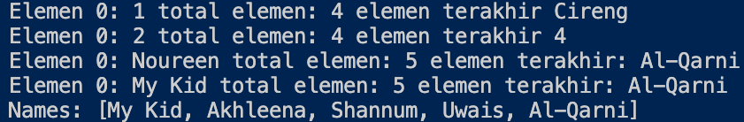

### *13.2.3 Pertanyaan*

1. Perhatikan baris kode 25-36, mengapa semua jenis data bisa ditampung ke dalam sebuah Arraylist?

    *Karena ArrayList tersebut tidak terdapat <> yang menyimpan secara spesifik data yang akan disimpan di dalamnya, sehingga ArrayList diatas bersifat sintak umum yang dapat menyimpan data segala jenis tipe data.*

2. Modifikasi baris kode 25-36 seingga data yang ditampung hanya satu jenis atau spesifik tipe tertentu!

    ~~~java
    List <Integer> l = new ArrayList();
    l.add(1);
    l.add(2);
    l.add(3);
    // l.add("Cireng");
    System.out.printf("Elemen 0: %d total elemen: %d elemen terakhir %s\n", l.get(0), l.size(), l.get(l.size() - 1));
    l.add(4);
    l.remove(0);
    System.out.printf("Elemen 0: %d total elemen: %d elemen terakhir %s\n", l.get(0), l.size(), l.get(l.size() - 1));
    ~~~

3. Ubah kode pada baris kode 38 menjadi seperti ini

    ~~~java
    LinkedList<String> names = new LinkedList<>();
    ~~~

    ~~~java
    LinkedList<String> names = new LinkedList<>();
    names.add("Noureen");
    names.add("Akhleema");
    names.add("Shannum");
    names.add("Uwais");
    names.add("Al-Qarni");
    System.out.printf("Elemen 0 : %s total elemen : %s elemen terakhir : %s\n", 
        names.get(0), names.size(), names.get(names.size() - 1));
    names.set(0, "My Kid");
    System.out.printf("Elemen 0 : %s total elemen : %s elemen terakhir : %s\n", 
        names.get(0), names.size(), names.get(names.size() - 1));
    System.out.println("Names : "+ names.toString());
    ~~~

4. Tambahkan juga baris berikut ini, untuk memberikan perbedaan dari tampilan yang sebelumnya

    ~~~java
    names.push("Mei-mei");
    System.out.printf("Elemen 0: %s total elemen: %s elemen terakhir: %s\n", names.getFirst(), names.size(), names.get(names.size() - 1));
    System.out.println("Names: " + names.toString());
    ~~~~

    ~~~java
    names.push("Mei-mei");
    System.out.printf("Elemen 0: %s total elemen : %s elemen terakhir : %s\n",
        names.getFirst(), names.size(), names.getLast());
    System.out.println("Names : "+ names.toString());
    ~~~

5. Dari penambahan kode tersebut, silakan dijalankan dan apakah yang dapat Anda jelaskan!

    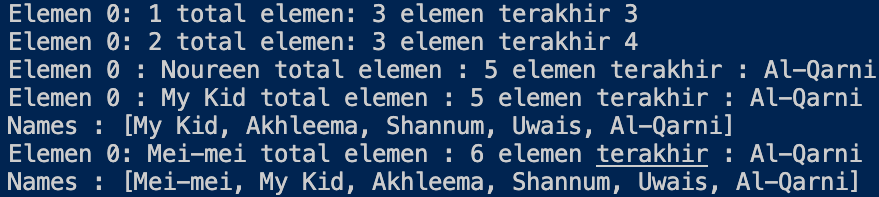

### **13.3  Kegiatan Praktikum 2**

### *13.3.1 Percobaan 2*

*Class "LoopCollection"*

~~~java
import java.util.Iterator;
import java.util.Stack;

public class LoopCollection {
    public static void main(String[] args) {
        Stack<String> fruits = new Stack<>();
        fruits.push("Banana");
        fruits.push("Orange");
        fruits.push("Watermelon");
        fruits.push("Leci");
        fruits.push("Salak");

        for (String fruit : fruits) {
            System.out.printf("%s ", fruit);
        }

        System.out.println("\n" + fruits.toString());

        while (!fruits.empty()) {
            System.out.printf("%s ", fruits.pop());
        }

        fruits.push("Melon");
        fruits.push("Durian");
        System.out.println("");
        for (Iterator<String> it = fruits.iterator(); it.hasNext();) {
            String fruit = it.next();
            System.out.printf("%s ", fruit);
        }
        System.out.println("");
        fruits.stream().forEach(e -> {
            System.out.printf("%s ", e);
        });
        System.out.println("");
        for (int i = 0; i < fruits.size(); i++) {
            System.out.printf("%s ", fruits.get(i));
        }
    }
}
~~~

### *13.3.2 Verfikasi Hasil Percobaan*

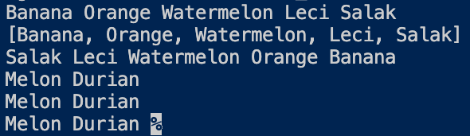

### *13.3.3 Pertanyaan*

1. Apakah perbedaan fungsi push() dan add() pada objek fruits?

    *Fungsi push() dan add() diatas sama-sama menambahkan elemen, yang membedakan diantara keduanya yaitu*

    - *push() merupakan fungsi dari interface stack*

    - *add() tidak atau bukan interface dari stack*

2. Silakan hilangkan baris 43 dan 44, apakah yang akan terjadi? Mengapa bisa demikian?

    ~~~java
    fruits.push("Melon");
    fruits.push("Durian");
    ~~~

    *Output*

    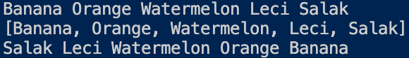

    *Yang terjadi adalah data "melon" dan "durian" tidak muncul, karena saat kita mengakses fungsi push() artinya kita akan menambahkan data "melon" dan "durian".*

3. Jelaskan fungsi dari baris 46-49?

    - *Baris 46, berfungsi untuk proses inisialisasi dan megatur aturan perulangan sesuai perintah yang diinstruksikan.*

    - *Baris 47, untuk pembuatan variabel fruit menjadi it.next().*

    - *Baris 48, berfungsi untuk mencetak variabel fruit.*

4. Silakan ganti baris kode 25, Stack<String> menjadi List<String> dan apakah yang terjadi? Mengapa bisa demikian?

    *Yang terjadi adalah error pada bagian push; empty; dan pop, karena tidak dapat dijalankan pada interface list, yang mana perintah di atas adalah fungsi dari interface stack.*

5. Ganti elemen terakhir dari dari objek fruits menjadi “Strawberry”!

    ~~~java
    import java.util.Iterator;
    import java.util.Stack;

    public class LoopCollection {
        public static void main(String[] args) {
            Stack<String> fruits = new Stack<>();
            fruits.push("Banana");
            fruits.push("Orange");
            fruits.push("Watermelon");
            fruits.push("Leci");
            fruits.push("Salak");

            for (String fruit : fruits) {
                System.out.printf("%s ", fruit);
            }

            System.out.println("\n" + fruits.toString());

            while (!fruits.empty()) {
                System.out.printf("%s ", fruits.pop());
            }

            fruits.push("Melon");
            fruits.push("Strawberry");
            System.out.println("");
            for (Iterator<String> it = fruits.iterator(); it.hasNext();) {
                String fruit = it.next();
                System.out.printf("%s ", fruit);
            }
            System.out.println("");
            fruits.stream().forEach(e -> {
                System.out.printf("%s ", e);
            });
            System.out.println("");
            for (int i = 0; i < fruits.size(); i++) {
                System.out.printf("%s ", fruits.get(i));
            }
        }
    }
    ~~~

    *Output*

    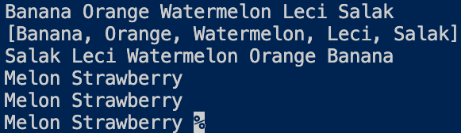

6. Tambahkan 3 buah seperti “Mango”,”guava”, dan “avocado” kemudian dilakukan sorting!

    ~~~java
    import java.util.Iterator;
    import java.util.Stack;
    import java.util.Collections;

    public class LoopCollectionEdit {
        public static void main(String[] args) {
            Stack<String> fruits = new Stack<>();
            fruits.push("Banana");
            fruits.push("Orange");
            fruits.push("Watermelon");
            fruits.push("Leci");
            fruits.push("Salak");

            for (String fruit : fruits) {
                System.out.printf("%s ", fruit);
            }

            System.out.println("\n" + fruits.toString());

            while (!fruits.empty()) {
                System.out.printf("%s ", fruits.pop());
            }

            fruits.push("Melon");
            fruits.push("Strawberry");
            System.out.println("");
            for (Iterator<String> it = fruits.iterator(); it.hasNext();) {
                String fruit = it.next();
                System.out.printf("%s ", fruit);
            }
            System.out.println("");
            fruits.stream().forEach(e -> {
                System.out.printf("%s ", e);
            });
            System.out.println("");
            for (int i = 0; i < fruits.size(); i++) {
                System.out.printf("%s ", fruits.get(i));
            }

            fruits.push("Manggo");
            fruits.push("Guava");
            fruits.push("Avocado");
        
            System.out.println("");
            System.out.println("\nData sesudah disorting ");
            Collections.sort(fruits);
            Iterator i= fruits.iterator();
        
            while(i.hasNext()){
                System.out.print(i.next() + "  ");
                System.out.println("");
            } 
        }
    }
    ~~~

    *Output*

    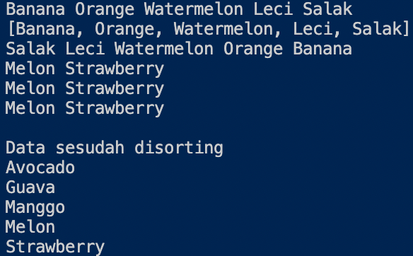

### **13.4  Kegiatan Praktikum 3**

### *13.4.1 Percobaan 3*

*Class "Mahasiswa"*

~~~java
public class Mahasiswa {
    String nim;
    String nama;
    String notelp;

    public Mahasiswa() {

    }

    public Mahasiswa(String nim, String nama, String notelp) {
        this.nim = nim;
        this.nama = nama;
        this.notelp = notelp;
    }

    @Override
    public String toString() {
        return "Mahasiswa{" + "nim=" + nim + ", nama=" + nama + ", notelp=" + notelp + '}';
    }
}
~~~

*Class "ListMahasiswa"*

~~~java
import java.util.ArrayList;
import java.util.Arrays;
import java.util.List;

public class ListMahasiswa {
    List<Mahasiswa> mahasiswas = new ArrayList<>();

    public void tambah(Mahasiswa... mahasiswa) {
        mahasiswas.addAll(Arrays.asList(mahasiswa));
    }

    public void hapus(int index) {
        mahasiswas.remove(index);
    }

    public void update(int index, Mahasiswa mhs) {
        mahasiswas.set(index, mhs);
    }

    public void tampil() {
        mahasiswas.stream().forEach(mhs -> {
            System.out.println("" + mhs.toString());
        });
    }

    int linearSearch(String nim) {
        for (int i = 0; i < mahasiswas.size(); i++) {
            if (nim.equals(mahasiswas.get(i).nim)) {
                return i;
            }
        }
        return -1;
    }

    public static void main(String[] args) {
        ListMahasiswa lm = new ListMahasiswa();
        Mahasiswa m = new Mahasiswa("201234", "Noureen", "021xx1");
        Mahasiswa m1 = new Mahasiswa("201235", "Akhleena", "021xx2");
        Mahasiswa m2 = new Mahasiswa("201236", "Shannum", "021xx3");
        lm.tambah(m, m1, m2);
        lm.tampil();
        lm.update(lm.linearSearch("201235"), new Mahasiswa("201235",
                "Akhleena Lela", "021xx2"));
        System.out.println("");
        lm.tampil();
    }
}
~~~

### *13.4.2 Verfikasi Hasil Percobaan*

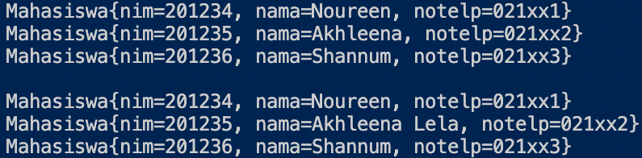

### *13.4.3 Pertanyaan*

1. Pada fungsi tambah() yang menggunakan unlimited argument itu menggunakan konsep apa? Dan kelebihannya apa?

    *Pada fungsi tambah() menggunakan konsep atau method addAll() dari collections dimana konsep ini memiliki kelebihan dapat menambahkan elemen tanpa ada batas jumlah elemen yang ditambahkan.*

2. Pada fungsi linearSearch() di atas, silakan diganti dengan fungsi binarySearch() dari collection!

3. Tambahkan fungsi sorting baik secara ascending ataupun descending pada class tersebut!

### *13.5 Tugas Praktikum*

1. Implementasikan stack menggunakan collection dengan contoh kasus tumpukan daftar film sesuai dengan fitur-fitur yang ditunjukkan pada gambar di bawah ini!

    **Ilustrasi Program**

    *Menu Awal dan Tambah Data (Push)*

    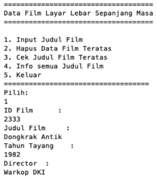

    *Cetak Semua Data Film*

    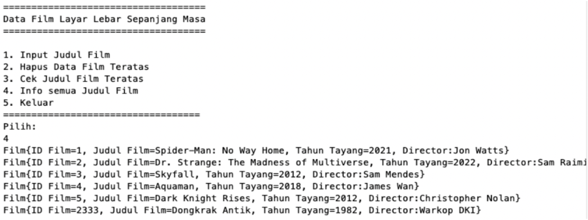

    *Cek Judul Film di tumpukan teratas*

    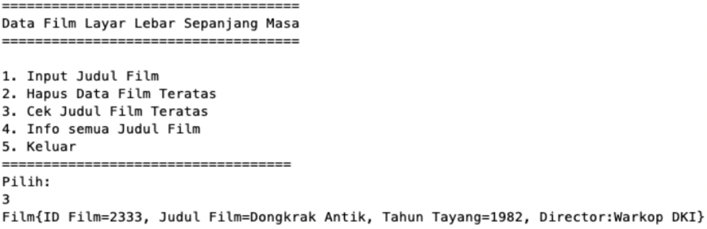

    *Hapus Film Teratas*

    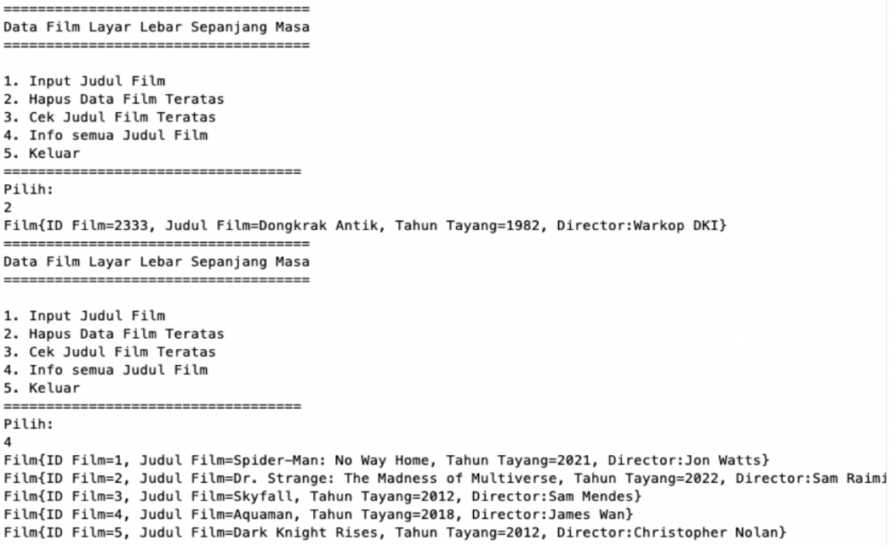

    ***Jawab***

    *Class "Film*

    ~~~java
    public class Film {
    String id, judul, tahun, director;
    
        public Film(String id, String judul, String tahun, String director){
            this.id = id;
            this.judul = judul;
            this.tahun = tahun;
            this.director = director;
        }
        @Override
        public String toString(){
            return "Film {ID Film = "+id +", Judul Film = "+judul+", Tahun Tayang = "+tahun+", Director = "+director+"}";
        }
    }
    ~~~

    *Main Class "FilmMain"*

    ~~~java
    import java.util.Scanner;
    import java.util.Stack;
    import java.util.Comparator;

    public class FilmMain {
        public static void main(String[] args) {
            Scanner sc = new Scanner(System.in);
            Scanner sd = new Scanner(System.in);
            Scanner sa = new Scanner(System.in);
            
            Stack <Film> films = new Stack();
            
            char pilih;
            int menu = 0;
            do{
                System.out.println("======================================");
                System.out.println(" Data Film Layar Lebar Sepanjang Masa ");
                System.out.println("======================================");
                System.out.println("1. Input Judul Film                   ");
                System.out.println("2. Hapus Data Film Teratas            ");
                System.out.println("3. Cek Judul Film Teratas             ");
                System.out.println("4. Info semua judul Film              ");
                System.out.println("5. Keluar                             ");
                System.out.println("======================================");
                System.out.println("Pilih: ");
                menu = sd.nextInt();
                switch(menu){
                    case 1:{
                        do { 
                        System.out.println("=====================================");
                        System.out.println("ID Film         : ");
                        String id = sc.nextLine();
                        System.out.println("Judul Film      : ");
                        String judul = sc.nextLine();
                        System.out.println("Tahun Tayang    : ");
                        String tahun = sc.nextLine();
                        System.out.println("Director        : ");
                        String director = sc.nextLine();
                        Film data = new Film(id, judul, tahun, director);
                        films.push(data);
                        System.out.println("Mau tambah data atau tidak Y/N");
                        pilih = sa.next().charAt(0);
                        System.out.println("");
                        
                        } while (pilih == 'y' || pilih == 'Y');
                        
                    }
                    break;

                    case 2 :{
                        System.out.println("=====================================");
                        System.out.println("       Hapus Data Film Teratas       ");
                        System.out.println("=====================================");
                        System.out.println(films.pop());
                        System.out.println("");
                    }
                    break;

                    case 3:{
                        System.out.println("=====================================");
                        System.out.println("           Judul Film Teratas        ");
                        System.out.println("=====================================");
                        System.out.println(films.peek());
                        System.out.println("");
                    }
                    break;

                    case 4:{
                        System.out.println("=====================================");
                        System.out.println("        Info Semua Judul Film        ");
                        System.out.println("=====================================");
                        for(int i = 0; i < films.size(); i++){
                            System.out.println(films.get(i));
                        }
                        System.out.println("");
                    }
                    break;
                    
                    case 5: {
                        System.out.println("");
                        System.out.println("+            Terima Kasih             +");
                    }
                    break;
                }
            }while (menu < 5 && menu > 0);
        }
    }
    ~~~

    *Output*

    *Menu Awal dan Tambah Data (Push)*

    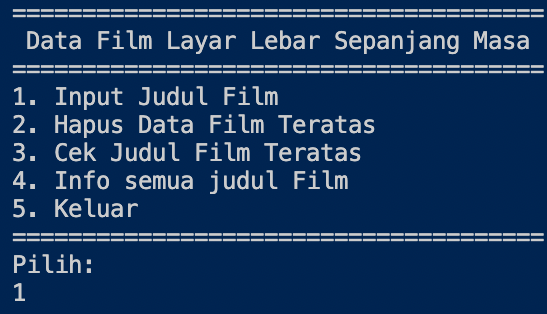

    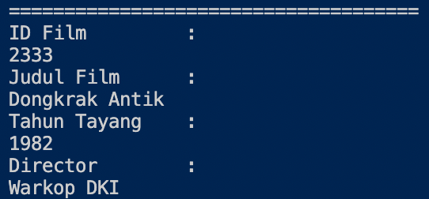

    *Cetak Semua Data Film*

    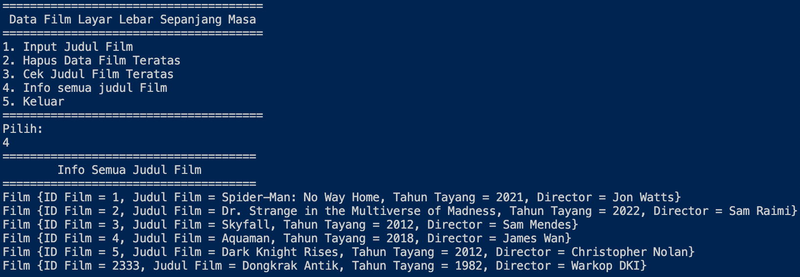

    *Cek Judul Film di tumpukan teratas*

    

    *Hapus Film Teratas*

    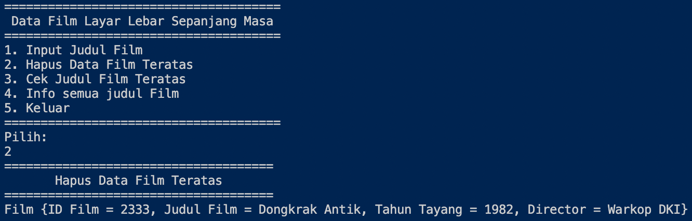

    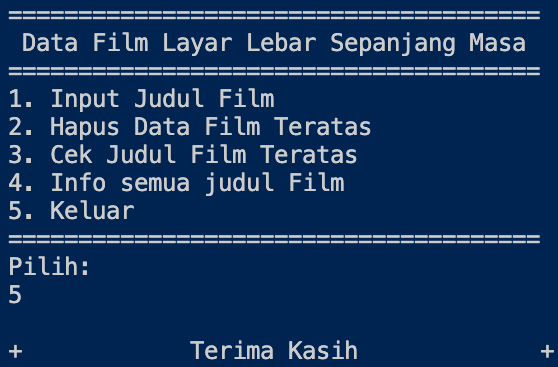

2. Buatlah implementasi program daftar nilai mahasiswa semester, minimal memiliki 3 class yaitu Mahasiswa, Nilai, dan Mata Kuliah. Khusus untuk data Mahasiswa dan Mata Kuliah harus sudah diinisialisasi, sehingga ketika memasukkan data nilai data mahasiswa dan mata kuliah cukup menginputkan nim ataupun kode mata kuliah. Yang paling

    **Ilustrasi Program**

    *Menu Awal dan Penambahan Data*

    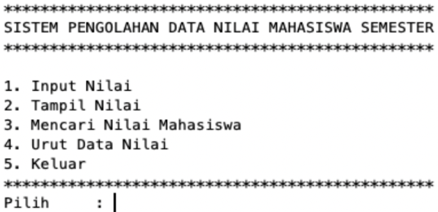

    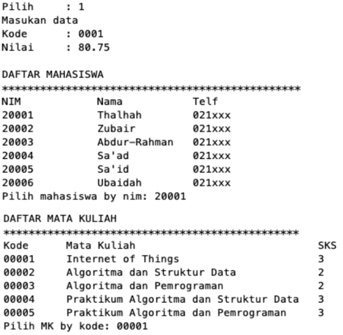

    *Tampil Nilai*

    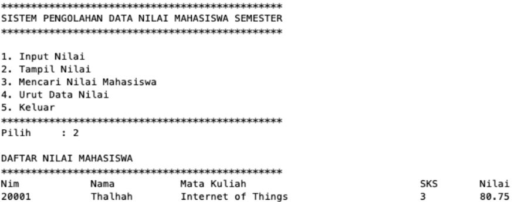

    *Pencarian Data Mahasiswa*

    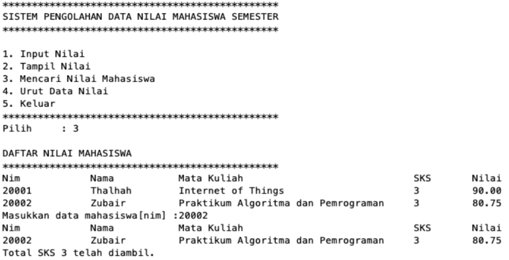

    *Pengurutan Data Nilai*

    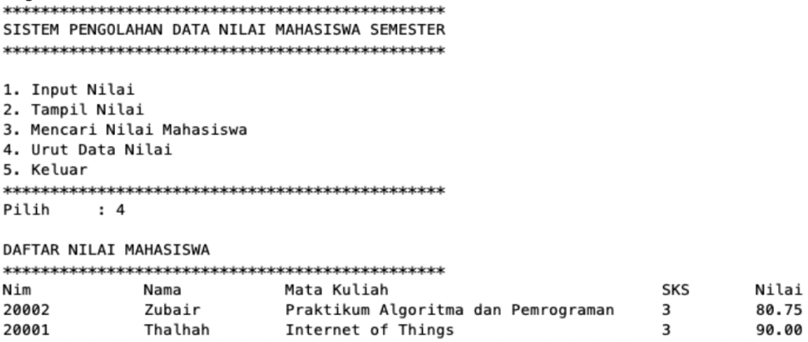