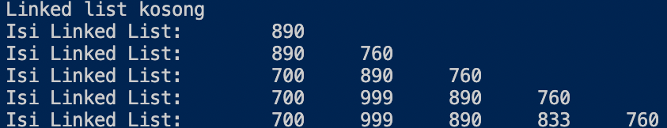
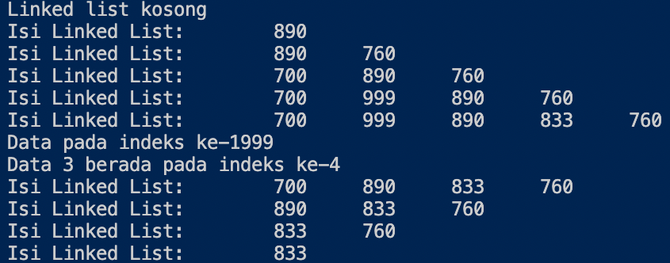
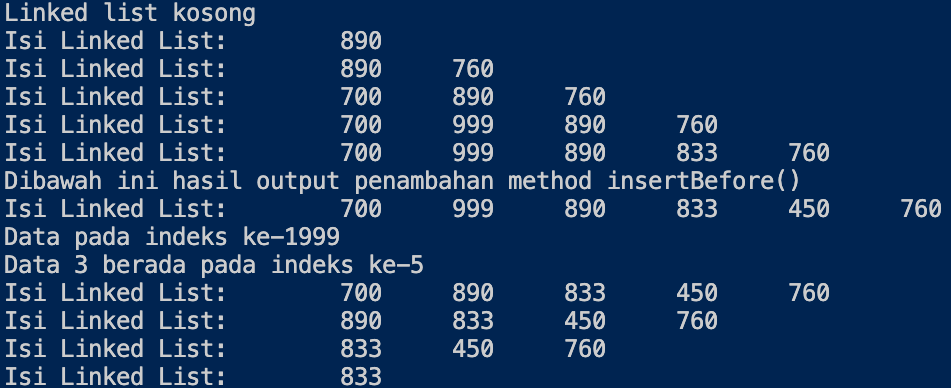
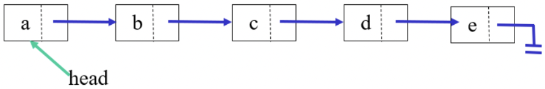
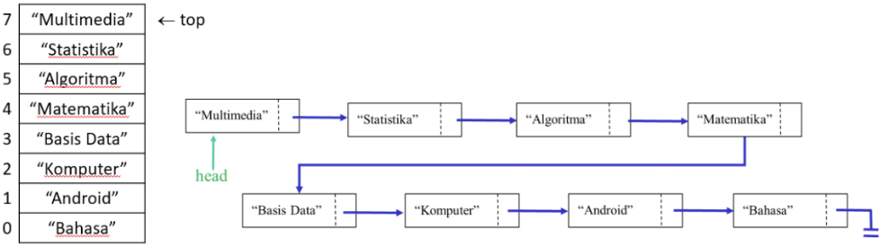

Nama    : Alfi Surya Pratama

Kelas   : TI-1F

NIM     : 2141720075

# **PRAKTIKUM ALGORITMA DAN STRUKTUR DATA**
## **JOBSHEET 9**
## **LINKED LIST**

### **9.2 Pembuatan Single Linked List**

### *9.2.1 Langkah-langkah Percobaan*

*Class "Node"*

~~~java
public class Node {
    int data;
    Node next;

    public Node(int nilai, Node berikutnya) {
        this.data = nilai;
        this.next = berikutnya;
    }
}
~~~

*Class "SingleLinkedList"*

~~~java
public class SingleLinkedList {
    Node head;
    Node tail;

    public boolean isEmpty() {
        return head == null;
    }

    public void print() {
        if (!isEmpty()) {
            Node tmp = head;
            System.out.print("Isi Linked List:\t");
            while (tmp != null) {
                System.out.print(tmp.data + "\t");
                tmp = tmp.next;
            }
            System.out.println("");
        } else {
            System.out.println("Linked list kosong");
        }
    }

    public void addFirst(int input) {
        Node ndInput = new Node(input, null);
        if (isEmpty()) {
            head = ndInput;
            tail = ndInput;
        } else {
            ndInput.next = head;
            head = ndInput;
        }
    }

    public void addLast(int input) {
        Node ndInput = new Node(input, null);
        if (isEmpty()) {
            head = ndInput;
            tail = ndInput;
        } else {
            tail.next = ndInput;
            tail = ndInput;
        }
    }

    public void insertAfter(int key, int input) {
        Node ndInput = new Node(input, null);
        Node temp = head;
        do {
            if (temp.data == key) {
                ndInput.next = temp.next;
                temp.next = ndInput;
                if(ndInput.next == null) tail = ndInput;
                break;
            }
            temp = temp.next;
        } while (temp != null);
    }

    public void insertAt(int index, int input) {
        if (index < 0) {
            System.out.println("indeks salah");
        } else if (index == 0){
            addFirst(input);
        } else {
            Node temp = head;
            for (int i = 0; i < index - 1; i++) {
                temp = temp.next;
            }
            temp.next = new Node(input, temp.next);
            if(temp.next.next == null) tail = temp.next;
        }
    }
}
~~~

*Main Class "SLLMain"*

~~~java
import javax.swing.SingleSelectionModel;

public class SLLMain {
    public static void main(String[] args) {
        SingleLinkedList singLL = new SingleLinkedList();
        singLL.print();
        singLL.addFirst(890);
        singLL.print();
        singLL.addLast(760);
        singLL.print();
        singLL.addFirst(700);
        singLL.print();
        singLL.insertAfter(700, 999);
        singLL.print();
        singLL.insertAt(3, 833);
        singLL.print();
    }
}
~~~

### *9.2.2 Verifikasi Hasil Percobaan*

### *9.2.3 Petanyaan*

1. Mengapa hasil compile kode program di baris pertama menghasilkan “Linked List Kosong”?

    *Karena Linked List (Node) masih belum memiliki isi (data), dimana pada SLLMain langsung dilakukan pemanggilan method print diawal pemanggilan yang mana Node masih belum diisi data sama sekali, sehingga sistem akan menampilkan "Linked List Kosong".*

2. Pada step 10, jelaskan kegunaan kode berikut

    ~~~java
    ndInput.next = temp.next;
    temp.next = ndInput;
    ~~~

    *Kegunaan potongan kode diatas adalah jika temp.data sama dengan key, maka kode program otomatis mengubah nilai variabel ndInput.next menjadi variabel temp.next serta nantinya pada variable ndInput untuk menyimpan nilainya.*

3. Perhatikan class SingleLinkedList, pada method insertAt Jelaskan kegunaan kode berikut 

    ~~~java
    if (temp.next.next == null) tail = temp.next;
    ~~~

    *Kegunaan potongan kode diatas adalah jika temp.next.next == nul maka akan mengembalikan nilai -1 atau data kosong, dan jika tidak ada kondisi yang terpenuhi sama sekali maka akan mengembalikan nilai dari index yaitu 0.*

### **9.3 Modifikasi Elemen pada Single Linked List**

### *9.3.1 Langkah-langkah Percobaan*

*Class "Node"*

~~~java
public class Node {
    int data;
    Node next;

    public Node(int nilai, Node berikutnya){
        this.data = nilai;
        this.next = berikutnya;
    }
}
~~~

*Class "SingleLinkedList"*

~~~java
public class SingleLinkedList {
    Node head;
    Node tail;

    public boolean isEmpty() {
        return head == null;
    }

    public void print() {
        if (!isEmpty()) {
            Node tmp = head;
            System.out.print("Isi Linked List:\t");
            while (tmp != null) {
                System.out.print(tmp.data + "\t");
                tmp = tmp.next;
            }
            System.out.println("");
        } else {
            System.out.println("Linked list kosong");
        }
    }

    public void addFirst(int input) {
        Node ndInput = new Node(input, null);
        if (isEmpty()) {
            head = ndInput;
            tail = ndInput;
        } else {
            ndInput.next = head;
            head = ndInput;
        }
    }

    public void addLast(int input) {
        Node ndInput = new Node(input, null);
        if (isEmpty()) {
            head = ndInput;
            tail = ndInput;
        } else {
            tail.next = ndInput;
            tail = ndInput;
        }
    }

    public void insertAfter(int key, int input) {
        Node ndInput = new Node(input, null);
        Node temp = head;
        do {
            if (temp.data == key) {
                ndInput.next = temp.next;
                temp.next = ndInput;
                if(ndInput.next == null) tail = ndInput;
                break;
            }
            temp = temp.next;
        } while (temp != null);
    }

    public void insertAt(int index, int input) {
        if (index < 0) {
            System.out.println("indeks salah");
        } else if (index == 0){
            addFirst(input);
        } else {
            Node temp = head;
            for (int i = 0; i < index - 1; i++) {
                temp = temp.next;
            }
            temp.next = new Node(input, temp.next);
            if(temp.next.next == null) tail = temp.next;
        }
    }

    public int getData(int index) {
        Node tmp = head;
        for (int i = 0; i < index; i++) {
            tmp = tmp.next;
        }
        return tmp.data;
    }

    public int indexOf(int key) {
        Node tmp = head;
        int index = 0;
        while (tmp != null && tmp.data != key) {
            tmp = tmp.next;
            index++;
        }

        if (tmp == null) {
            return -1;
        } else {
            return index;
        }
    }
    
    public void removeFirst() {
        if (isEmpty()) {
            System.out.println("Linked List masih Kosong, tidak dapat dihapus!");
        } else if (head == tail) {
            head = tail = null;
        } else {
            head = head.next;
        }
    }

    public void removeLast() {
        if (isEmpty()) {
            System.out.println("Linked List masih Kosong, tidak dapat dihapus!");
        } else if (head == tail) {
            head = tail = null;
        } else {
            Node temp = head;
            while (temp.next != tail) {
                temp = temp.next;
            }
            temp.next = null;
            tail = temp;
        }
    }

    public void remove(int key) {
        if (isEmpty()) {
            System.out.println("Linked list masih Kosong, tidak dapat dihapus!");
        } else {
            Node temp = head;
            while (temp != null) {
                if ((temp.data == key) && (temp == head)) {
                    this.removeFirst();
                    break;
                } else if (temp.next.data == key) {
                    temp.next = temp.next.next;
                    if (temp.next == null) {
                        tail = temp;
                    }
                    break;
                }
                temp = temp.next;
            }
        }
    }

    public void removeAt(int index) {
        if (index == 0) {
            removeFirst();
        } else{
            Node temp = head;
            for (int i = 0; i < index - 1; i++) {
                temp = temp.next;
            }
            temp.next = temp.next.next;
            if (temp.next == null) {
                tail = temp;
            }
        }
    }
}
~~~

*Main Class "SLLMain"*

~~~java
import javax.swing.SingleSelectionModel;

public class SLLMain {
    public static void main(String[] args) {
        SingleLinkedList singLL = new SingleLinkedList();
        singLL.print();
        singLL.addFirst(890);
        singLL.print();
        singLL.addLast(760);
        singLL.print();
        singLL.addFirst(700);
        singLL.print();
        singLL.insertAfter(700, 999);
        singLL.print();
        singLL.insertAt(3, 833);
        singLL.print();

        System.out.println("Data pada indeks ke-1" + singLL.getData(1));
        System.out.println("Data 3 berada pada indeks ke-" + singLL.indexOf(760));

        singLL.remove(999);
        singLL.print();
        singLL.removeAt(0);
        singLL.print();
        singLL.removeFirst();
        singLL.print();
        singLL.removeLast();
        singLL.print();
    }
}
~~~

### *9.3.2 Verifikasi Hasil Percobaan*

### *9.3.3 Petanyaan*

1. Mengapa digunakan keyword break pada fungsi remove? Jelaskan!

    *Karena keyword break tersebut berfungsi untuk menghentikan perulangan (loop). Terdapat dua break yang ada pada method remove, break yang pertama berfungsi jika data yang dihapus ada pada head dan ditemukan maka program akan langsung break, sedangkan break yang kedua berfungsi jika data yang dihapus berada ditengah dan ditemukan maka program akan langsung break.*

2. Jelaskan kegunaan kode dibawah pada method remove

    ~~~java
    else if (temp.next.data == key){
        temp.next = temp.next.next;
    ~~~

    *Potongan kode diatas berfungsi jika node yang dipilih memiliki data yang sama dengan (equals) key, maka terjadi perubahan posisi dimana node tersebut akan digantikan oleh node yang selanjutnya.*

3. Apa saja nilai kembalian yang dapat dikembalikan pada method indexOf? Jelaskan maksud masing-masing kembalian tersebut!

    *Di dalam method indexOf terdapat 2 return, yaitu :*

    *• jika tmp == null maka akan mengembalikan nilai -1 atau data kosong*

    *• jika tidak ada kondisi yang terpenuhi sama sekali maka akan mengembalikan nilai index yaitu 0*

### **9.4 Tugas**

1. Buat method insertBefore untuk menambahkan node sebelum keyword yang diinginkan

    ***Jawab***

    *Class "Node"*

    ~~~java
    class Node {
        int data;
        Node next;

        public Node(int nilai, Node berikutnya) {
            this.data = nilai;
            this.next = berikutnya;
        }
    }
    ~~~

    *Class "Tugas1_SLL"*

    ~~~java
    public class SingleLinkedList {
        Node head;
        Node tail;

        public boolean isEmpty() {
            return head == null;
        }

        public void print() {
            if (!isEmpty()) {
                Node tmp = head;
                System.out.print("Isi Linked List:\t");
                while (tmp != null) {
                    System.out.print(tmp.data + "\t");
                    tmp = tmp.next;
                }
                System.out.println("");
            } else {
                System.out.println("Linked list kosong");
            }
        }

        public void addFirst(int input) {
            Node ndInput = new Node(input, null);
            if (isEmpty()) {
                head = ndInput;
                tail = ndInput;
            } else {
                ndInput.next = head;
                head = ndInput;
            }
        }

        public void addLast(int input) {
            Node ndInput = new Node(input, null);
            if (isEmpty()) {
                head = ndInput;
                tail = ndInput;
            } else {
                tail.next = ndInput;
                tail = ndInput;
            }
        }

        public void insertAfter(int key, int input) {
            Node ndInput = new Node(input, null);
            Node temp = head;
            do {
                if (temp.data == key) {
                    ndInput.next = temp.next;
                    temp.next = ndInput;
                    if(ndInput.next == null) tail = ndInput;
                    break;
                }
                temp = temp.next;
            } while (temp != null);
        }

        public void insertAt(int index, int input) {
            if (index < 0) {
                System.out.println("indeks salah");
            } else if (index == 0){
                addFirst(input);
            } else {
                Node temp = head;
                for (int i = 0; i < index - 1; i++) {
                    temp = temp.next;
                }
                temp.next = new Node(input, temp.next);
                if(temp.next.next == null) tail = temp.next;
            }
        }

        public int getData(int index) {
            Node tmp = head;
            for (int i = 0; i < index; i++) {
                tmp = tmp.next;
            }
            return tmp.data;
        }

        public int indexOf(int key) {
            Node tmp = head;
            int index = 0;
            while (tmp != null && tmp.data != key) {
                tmp = tmp.next;
                index++;
            }

            if (tmp == null) {
                return -1;
            } else {
                return index;
            }
        }
        
        public void removeFirst() {
            if (isEmpty()) {
                System.out.println("Linked List masih Kosong, tidak dapat dihapus!");
            } else if (head == tail) {
                head = tail = null;
            } else {
                head = head.next;
            }
        }

        public void removeLast() {
            if (isEmpty()) {
                System.out.println("Linked List masih Kosong, tidak dapat dihapus!");
            } else if (head == tail) {
                head = tail = null;
            } else {
                Node temp = head;
                while (temp.next != tail) {
                    temp = temp.next;
                }
                temp.next = null;
                tail = temp;
            }
        }

        public void remove(int key) {
            if (isEmpty()) {
                System.out.println("Linked list masih Kosong, tidak dapat dihapus!");
            } else {
                Node temp = head;
                while (temp != null) {
                    if ((temp.data == key) && (temp == head)) {
                        this.removeFirst();
                        break;
                    } else if (temp.next.data == key) {
                        temp.next = temp.next.next;
                        if (temp.next == null) {
                            tail = temp;
                        }
                        break;
                    }
                    temp = temp.next;
                }
            }
        }

        public void removeAt(int index) {
            if (index == 0) {
                removeFirst();
            } else{
                Node temp = head;
                for (int i = 0; i < index - 1; i++) {
                    temp = temp.next;
                }
                temp.next = temp.next.next;
                if (temp.next == null) {
                    tail = temp;
                }
            }
        }

        public void insertBefore(int key, int input){
            Node ndInput = new Node(input, null);
            Node temp = head;
            Node prev = null;
        
            do {
                if (head.data == key) {
                    addFirst(input);
                    break;
                } else if (temp.data == key) {
                    ndInput.next = temp;
                    prev.next = ndInput;
                    if(temp.next == null){
                        tail = ndInput;
                        break;
                    }
                }
                prev = temp;
                temp = temp.next;
            } while (temp != null);
        }
    }
    ~~~

    *Main Class "Tugas1_SLLMain"*

    ~~~java
    import javax.swing.SingleSelectionModel;

    public class SLLMain {
        public static void main(String[] args) {
            SingleLinkedList singLL = new SingleLinkedList();
            singLL.print();
            singLL.addFirst(890);
            singLL.print();
            singLL.addLast(760);
            singLL.print();
            singLL.addFirst(700);
            singLL.print();
            singLL.insertAfter(700, 999);
            singLL.print();
            singLL.insertAt(3, 833);
            singLL.print();

            System.out.println("Dibawah ini hasil output penambahan method insertBefore()");
            singLL.insertBefore(760, 450);
            singLL.print();

            System.out.println("Data pada indeks ke-1" + singLL.getData(1));
            System.out.println("Data 3 berada pada indeks ke-" + singLL.indexOf(760));

            singLL.remove(999);
            singLL.print();
            singLL.removeAt(0);
            singLL.print();
            singLL.removeFirst();
            singLL.print();
            singLL.removeLast();
            singLL.print();
        }
    }
    ~~~

    *Output*

    

2. Implementasikan ilustrasi Linked List Berikut. Gunakan 4 macam penambahan data yang telah
dipelajari sebelumnya untuk menginputkan data.

    

3. Buatlah Implementasi Stack berikut menggunakan Single Linked List

    

4. Buatlah implementasi program antrian untuk mengilustasikan mahasiswa yang sedang meminta tanda tangan KRS pada dosen DPA di kampus pada tugas jobsheet 8 menggunakan LinkedList. Implementasikan Queue pada antrian mahasiswa dengan menggunakan konsep LinkedList!

    *Class "Node"*

    ~~~java
    public class Node {
        String nim, nama;
        int absen;
        double ipk;
        Node next;

        public Node(String nim, String nama, int absen, double ipk, Node berikutnya){
            this.nim = nim;
            this.nama = nama;
            this.absen = absen;
            this.ipk =ipk;
            this.next = berikutnya;
        }
    }
    ~~~

    *Class "Tugas4_SLL"*

    ~~~java
    public class Tugas4_SLL {
    Node head; //posisi awal linked list
    Node tail; //posisi akhir linked list

        public boolean isEmpty() {
            return head == null;
        }

        public void print(){
            if(!isEmpty()){
                Node tmp = head;
                int antrian = 0;
                while(tmp != null){
                    System.out.println("Mahasiswa ke - "+(antrian+1));
                    System.out.println("NIM Mahasiswa   : " + tmp.nim);
                    System.out.println("Nama Mahasiswa  : " + tmp.nama);
                    System.out.println("Absen Mahasiswa : " + tmp.absen);
                    System.out.println("IPK Mahasiswa   : " + tmp.ipk);
                    tmp = tmp.next;
                    antrian ++;
                }
                System.out.println();
            }else{
                System.out.println("Linked List Kosong");
            }
        }

        public void addLast(String nim, String nama, int absen, double ipk){
            Node ndInput = new Node(nim, nama, absen, ipk, null);
            if(isEmpty()){
                head = ndInput; //head dan tail sama dengan node input
                tail = ndInput;
            }else{
                tail.next = ndInput;
                tail = ndInput;
            }
        }

        public void peek(){
            if(!isEmpty()){
                Node tmp = head;
                System.out.println("Elemen terdepan");
                System.out.println("NIM Mahasiswa   : " + tmp.nim);
                System.out.println("Nama Mahasiswa  : " + tmp.nama);
                System.out.println("Absen Mahasiswa : " + tmp.absen);
                System.out.println("IPK Mahasiswa   : " + tmp.ipk);
            }else{
                System.out.println("Queue masih kosong");
            }
        }

        public void peekRear(){
            if(!isEmpty()){
                Node tmp = tail;
                System.out.println("Elemen yang belakang");
                System.out.println("NIM Mahasiswa   : " + tmp.nim);
                System.out.println("Nama Mahasiswa  : " + tmp.nama);
                System.out.println("Absen Mahasiswa : " + tmp.absen);
                System.out.println("IPK Mahasiswa   : " + tmp.ipk);
            }else{
                System.out.println("Queue masih kosong");
            }
        }

        public void cariIndex(int index){
            if(isEmpty()){
                System.out.println("Antrian masih kosong");
            }else{
                Node tmp = head;
                for(int i=0; i<index; i++){
                    tmp = tmp.next;
                }
                System.out.println("Data pada index ke-"+index);
                System.out.println("NIM Mahasiswa   : " + tmp.nim);
                System.out.println("Nama Mahasiswa  : " + tmp.nama);
                System.out.println("Absen Mahasiswa : " + tmp.absen);
                System.out.println("IPK Mahasiswa   : " + tmp.ipk);
            }
        }
        
        public void cariNim(String key){
            Node tmp = head;
            int index = 0;
            while (tmp != null &&(!(tmp.nim.equals(key)))) {
                tmp = tmp.next;
                index++;
            }
            if (tmp == null){
                System.out.println("Antrian Kosong");
            }else{
                System.out.println("Data "+key+" berada pada index ke "+index);
            }
            System.out.println("Data Mahasiswa");
            System.out.println("NIM Mahasiswa   : " + tmp.nim);
            System.out.println("Nama Mahasiswa  : " + tmp.nama);
            System.out.println("Absen Mahasiswa : " + tmp.absen);
            System.out.println("IPK Mahasiswa   : " + tmp.ipk);
        }
        public void removeFirst(){
            if(isEmpty()){
                System.out.println("Linked List Masih Kosong");
            }else if (head == tail){
                head = tail = null;
            }else{
                head = head.next;
            }
        }
    }
    ~~~

    *Class "Tugas4_SLLMain"*

    ~~~java
    import java.util.Scanner;

    public class Tugas4_SLLMain {
        public static void menu(){
            System.out.println("\nPilih Menu ");
            System.out.println(" 1. Antrian Baru\n 2. Antrian Keluar\n 3. Cek Antrian Terdepan\n 4. Cek Semua Antrian\n 5. Cek Antrian Paling Belakang\n 6. Cari Index Mahasiswa dengan NIM\n 7. Cek Data Mahasiswa berdasarkan Antrian\n 8. Keluar");
            System.out.println("------------------------------------------");
        }
        public static void main(String[] args) {
            Scanner sc = new Scanner(System.in);
            Scanner sd = new Scanner(System.in);
            Scanner sb = new Scanner(System.in);
        
            Tugas4_SLL singLL = new Tugas4_SLL();

            int pilih;
            do{
                menu();
                pilih = sc.nextInt();
                sc.nextLine();
        
                switch(pilih){
                    case 1:
                        System.out.print("NIM Mahasiswa\t: ");
                        String nim = sc.nextLine();
                        System.out.print("Nama Mahasiswa\t: ");
                        String nama = sc.nextLine();
                        System.out.print("Absen Mahasiswa\t: ");
                        int absen = sd.nextInt();
                        System.out.print("IPK Mahasiswa\t: ");
                        double ipk = sb.nextDouble();
                        singLL.addLast(nim, nama, absen, ipk);
                        sc.nextLine();
                    break;
                    
                    case 2:
                        singLL.removeFirst();
                        System.out.println("Mahasiswa urutan awal berhasil keluar!!!");
                        System.out.println("Dengan sisa antrian dibawah ini: \n");
                        singLL.print();
                    break;
                    
                    case 3:
                        System.out.println("Berikut adalah antrian mahasiswa terdepan:");
                        singLL.peek();
                    break;
                    
                    case 4:
                        System.out.println("Berikut adalah data semua antrian:");
                        singLL.print();
                    break;
                    
                    case 5:
                        System.out.println("Berikut adalah antrian mahasiswa paling belakang:");
                        singLL.peekRear();
                    break;
                    
                    case 6:
                        System.out.println("Pencarian Index Mahasiswa Dengan NIM");
                        System.out.print("Masukkan NIM mahasiswa : ");
                        String nimm = sc.nextLine();
                        singLL.cariNim(nimm);
                    break;
                    
                    case 7:
                        System.out.println("Pencarian data mahasiswa berdasarkan antrian");
                        System.out.print("Masukkan antrian mahasiswa: ");
                        int antrian = sd.nextInt();
                        singLL.cariIndex(antrian);
                    break;
                    
                    case 8:
                        System.out.println("Terima Kasih Telah menggunakan layanan kami");
                        System.exit(0);
                    break;
                }
            } while (pilih == 1 || pilih == 2 || pilih == 3 || pilih == 4 || pilih == 5 || pilih == 6 || pilih == 7 || pilih == 8);
        }
    }
    ~~~

    *Output*